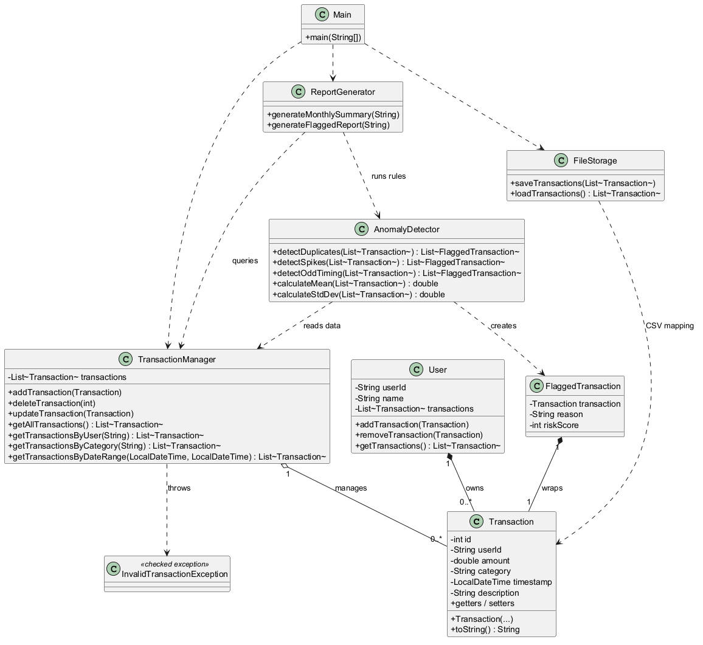
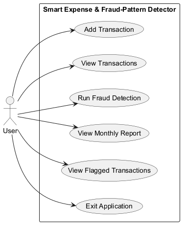
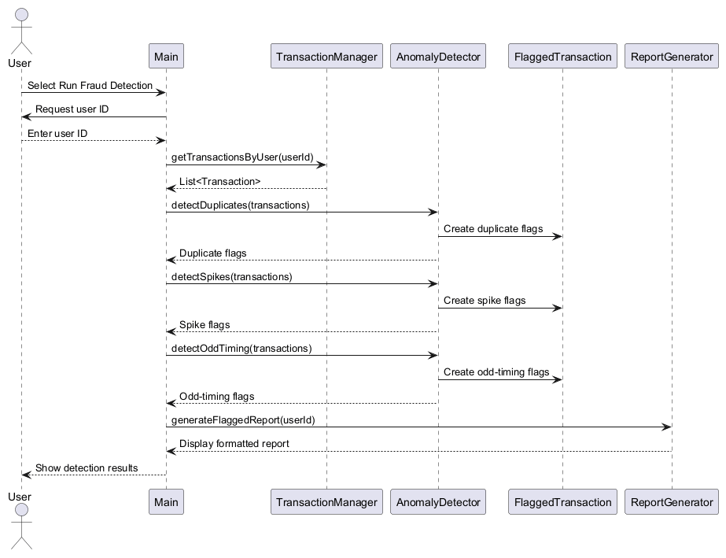
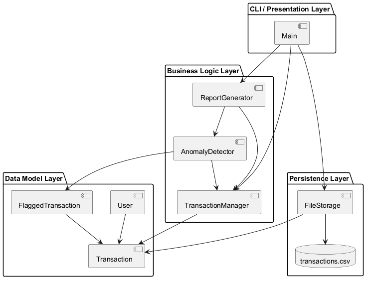
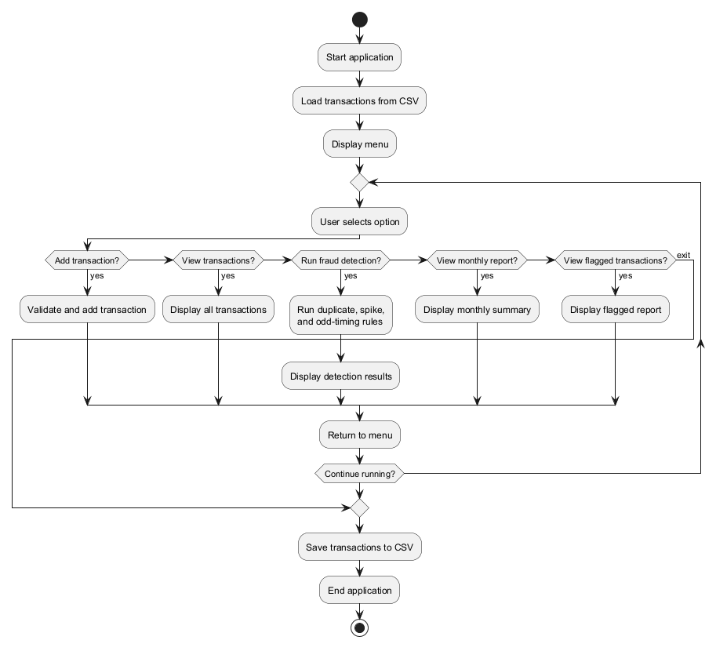
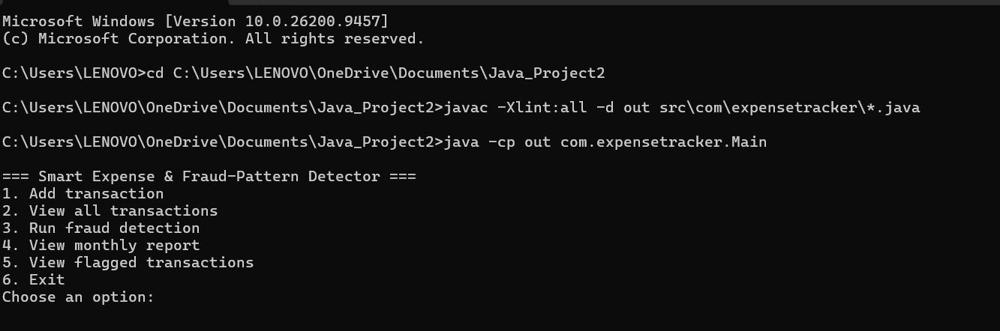
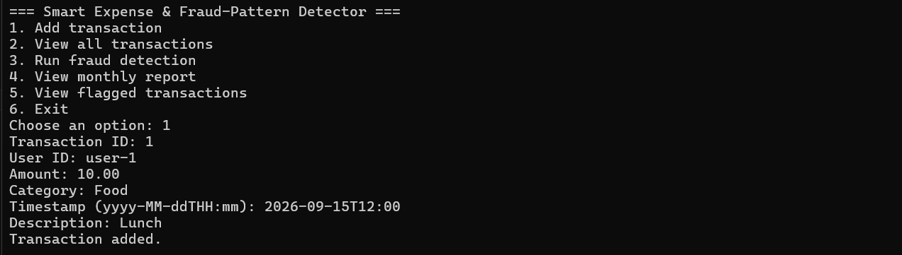
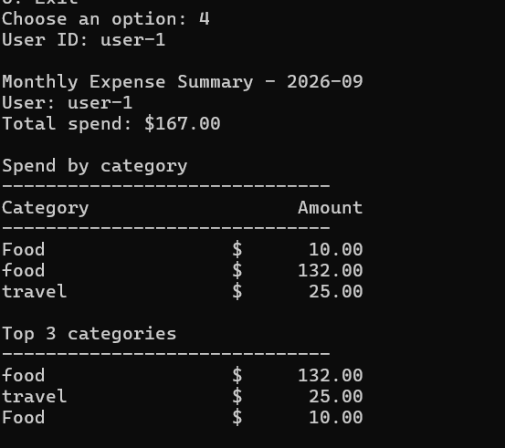
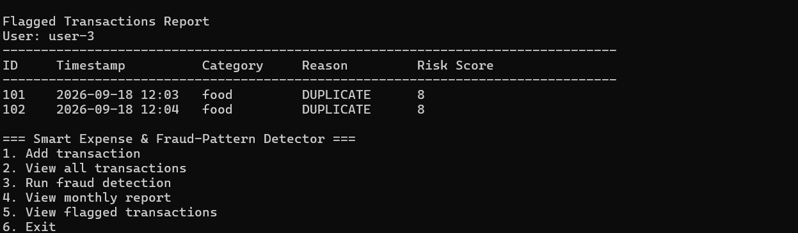

# Smart Expense & Fraud-Pattern Detector

<div align="center">

## Smart Expense & Fraud-Pattern Detector

### A Core Java Console Application for Rule-Based Transaction Anomaly Detection

**Submitted by:** Praful  
**Course:** Core Java  
**Submission Date:** September 18, 2026

</div>

---

## Introduction

The Smart Expense & Fraud-Pattern Detector is a Core Java console application that helps users track expenses and identify potentially suspicious transactions. It uses rule-based anomaly detection to flag duplicate charges, abnormal spending spikes, and transactions occurring during unusual hours.

The application provides transaction management, input validation, CSV persistence, monthly summaries, flagged-transaction reports, and a command-line interface. Its implementation uses standard JDK classes and follows a modular design with separate classes for data modeling, transaction management, anomaly detection, reporting, and storage.

## Problem Statement

Individuals and small businesses often fail to notice duplicate charges, unusual spending spikes, or transactions made at irregular times until it is too late. These overlooked patterns can result in financial loss, inaccurate expense records, and limited visibility into how money is being spent.

Most personal finance tools provide totals, balances, and category summaries, but do not actively flag suspicious transaction patterns. Users may therefore need to inspect long lists of transactions manually to identify repeated charges, unexpectedly large expenses, or activity occurring during unusual hours.

The Smart Expense & Fraud-Pattern Detector addresses this problem through a Core Java console application that records expense transactions and applies transparent, rule-based anomaly detection. It identifies possible duplicates, detects spending spikes using the `mean + 2 * standard deviation` threshold, and flags transactions occurring between midnight and 5:00 AM so users can review potentially suspicious activity earlier.

## Functional Requirements

- **FR-1:** The system shall allow users to add expense transactions containing an ID, user ID, amount, category, timestamp, and description.
- **FR-2:** The system shall validate transaction input and reject null transactions, negative or non-finite amounts, blank user IDs, blank categories, and missing timestamps.
- **FR-3:** The system shall allow users to view all stored transactions through the command-line interface.
- **FR-4:** The system shall support updating and deleting transactions by transaction ID while reporting when a requested transaction does not exist.
- **FR-5:** The system shall retrieve transactions by user, category, and inclusive date-time range.
- **FR-6:** The system shall detect duplicate transactions with the same user, amount, and category within a configurable five-minute time window.
- **FR-7:** The system shall detect category spending spikes when a transaction amount exceeds the historical mean plus two standard deviations for that user's category spending.
- **FR-8:** The system shall flag transactions occurring between midnight and 5:00 AM and assign each detected anomaly a reason and risk score.
- **FR-9:** The system shall generate monthly and flagged-transaction reports and save or load transaction data using CSV storage across application sessions.

## Non-Functional Requirements

| Requirement | Description | How It's Met |
|---|---|---|
| Performance | The application should process expense data efficiently for typical personal and small-business transaction volumes. | Anomaly detection uses linear scans, with algorithms designed to operate in `O(n)` time per category scan. |
| Reliability | The system should reject invalid data and continue operating when recoverable errors occur. | `TransactionManager` validates null, negative, and invalid values before insertion, while the CLI catches exceptions and continues running. |
| Maintainability | The system should be modular so that individual responsibilities can be modified without affecting unrelated functionality. | Each class has a single responsibility: `Transaction` models data, `TransactionManager` handles CRUD, `AnomalyDetector` applies fraud rules, `ReportGenerator` displays reports, and `FileStorage` manages persistence. |
| Usability | The application should provide clear interaction and preserve data across sessions. | The CLI provides a simple numbered menu, readable reports, validation messages, and CSV storage with graceful handling of missing files. |
| Security and Data Integrity | The application should protect transaction data from malformed input and storage corruption caused by special characters. | Input validation rejects invalid transaction values, and CSV fields are escaped correctly to preserve commas and quotation marks during storage and loading. |

## System Architecture

The system is organized into four layers. The CLI/Presentation Layer is represented by `Main`, which handles menu input and coordinates application operations. The Business Logic Layer contains `TransactionManager` for CRUD operations and validation, `AnomalyDetector` for duplicate, spike, and odd-timing rules, and `ReportGenerator` for formatted summaries and flagged-transaction reports.

The Data Model Layer contains `Transaction`, `User`, and `FlaggedTransaction`, which represent expense data, user-owned transactions, and anomaly results. The Persistence Layer is represented by `FileStorage`, which reads and writes transaction data to the local `transactions.csv` file.

## Design Diagrams

### Class Diagram



The class diagram shows the data models, service classes, custom exception, and their relationships. It maps the implementation by showing `TransactionManager` managing transactions, `User` owning transactions, `AnomalyDetector` creating `FlaggedTransaction` results, and `ReportGenerator`, `FileStorage`, and `Main` depending on the appropriate services.

### Use Case Diagram



The use case diagram presents the application from the user's perspective through the six CLI actions: adding, viewing, and analyzing transactions, viewing reports, and exiting. The single `User` actor interacts with the console workflow implemented by `Main`.

### Sequence Diagram



The sequence diagram traces the `Run Fraud Detection` menu flow from `Main` to `TransactionManager`, which retrieves the user's transactions, and then to `AnomalyDetector`, which runs duplicate, spike, and odd-timing checks. The resulting `FlaggedTransaction` objects are passed to `ReportGenerator` for display before the result returns to `Main` and the user.

### System Architecture / Component Diagram



The component diagram illustrates the four-layer architecture and the direction of dependencies between the CLI, business logic, data model, and persistence components. It reflects the actual implementation in which `Main` orchestrates services, business classes use the data models, and `FileStorage` persists transactions to `transactions.csv`.

### Process Flow / Activity Diagram



The activity diagram shows the complete application lifecycle: loading CSV data, displaying the menu, executing a selected operation, returning to the menu, and saving data when the user exits. This corresponds to the control loop in `Main`, including the final save performed through `FileStorage`.

## Design Decisions & Rationale

1. **CSV File Storage Instead of a Relational Database**  
   CSV storage was selected because it is human-readable, easy to inspect and debug, and does not require external database setup for a course-scoped project. SQLite with JDBC was considered but rejected because its configuration and connection-management requirements would add complexity that is not justified by the application's data volume.

2. **Rule-Based Detection Instead of Machine Learning**  
   Rule-based detection provides transparent and explainable decisions through understandable thresholds such as `mean + 2 * standard deviation`. A machine-learning classifier was rejected because it would require a labeled dataset and external ML libraries, while also making it more difficult to explain why a transaction was flagged.

3. **Mean Plus Two Standard Deviations for Spike Detection**  
   The `mean + 2 * standard deviation` threshold was chosen because it is a standard statistical definition for identifying potential outliers and adapts to each user's spending baseline within a category. A fixed dollar threshold was rejected because it would not generalize effectively across users with different spending habits and income levels.

4. **Five-Minute Window for Duplicate Detection**  
   A five-minute window was selected because it reflects realistic accidental duplicate charges, such as double-tapping a payment button or a point-of-sale retry. A same-day window was rejected because it would be too broad and could incorrectly flag legitimate repeat purchases made several hours apart.

5. **Single-Responsibility Class Separation**  
   Separate classes were used for `Transaction`, `TransactionManager`, `AnomalyDetector`, `ReportGenerator`, and `FileStorage` so that each component can be tested, modified, and maintained independently. Placing all logic directly in `Main` was rejected because it would create a monolithic class that is harder to test, understand, and extend.

6. **Checked Exception for Invalid Transaction Data**  
   The checked `InvalidTransactionException` was chosen because it requires calling code to explicitly handle invalid transaction scenarios, which is appropriate for a validation-heavy financial application. An unchecked exception was rejected because invalid states could propagate without being handled clearly at the point where user input is processed.

## Core Detection Rules

### Duplicate Detection

Transactions are flagged as duplicates when they belong to the same user, have the same amount and category, and occur within five minutes of each other.

### Spending Spike Detection

A transaction is flagged when its amount exceeds the user's historical category baseline calculated as:

```text
mean + 2 * standard deviation
```

### Odd-Timing Detection

Transactions made between midnight and 5:00 AM are flagged as unusual because they may indicate unexpected or suspicious activity.

## Main Components

- `Transaction` stores expense data.
- `User` owns a user's transactions.
- `TransactionManager` performs CRUD operations and validation.
- `AnomalyDetector` applies fraud-detection rules.
- `FlaggedTransaction` stores an anomaly reason and risk score.
- `ReportGenerator` creates formatted reports.
- `FileStorage` reads and writes CSV data.
- `Main` controls the console menu and application lifecycle.

## Implementation Scope

The application is designed for a course-scoped project and uses only the standard Java Development Kit for production code. It focuses on explainable, deterministic anomaly rules rather than predictive fraud modeling, making the results easy for users and developers to understand.

## Testing Approach

Unit testing was planned with JUnit 5 for `TransactionManager` and `AnomalyDetector`. The `TransactionManagerTest.java` test file covers `addTransaction`, including validation of negative amounts, blank fields, and duplicate transaction IDs, while also testing the spike-detection logic in `AnomalyDetector`.

Spike-detection tests verify that the `mean + 2 * standard deviation` threshold correctly flags significant outliers and does not produce false positives for normal transactions. Manual end-to-end testing was also performed through the CLI using the nine-step walkthrough in the README: adding normal, duplicate, spike, and odd-timing transactions and verifying that each anomaly was correctly flagged. Testing therefore focused on both unit-level validation logic and integration-level detection accuracy.

## Screenshots / Results


(1) main menu
,

(2) adding a transaction,


(3) monthly summary report.


(4) DUPLICATE Transaction


## Challenges Faced

Selecting a statistical threshold for spending spikes was challenging because an overly sensitive rule could flag ordinary purchases, while a threshold that was too broad could miss meaningful anomalies. This was resolved by using the standard `mean + 2 * standard deviation` rule and testing it against both normal historical values and a clear outlier.

Handling CSV edge cases required care because descriptions and other text fields can contain commas, quotation marks, or line breaks. This was resolved by implementing CSV escaping when writing records and corresponding quoted-field parsing when loading them.

Using a checked `InvalidTransactionException` improved explicit error handling but could make method calls more verbose because callers must handle or declare the exception. The design resolved this trade-off by using the checked exception at transaction-management boundaries where invalid financial data must be handled deliberately, while keeping lower-level model classes simple.

Designing a configurable five-minute duplicate window required balancing realistic duplicate-charge detection with a simple API. This was resolved by providing a default five-minute constructor and a second constructor that accepts a positive `Duration` for customized detection windows.

## Learnings & Key Takeaways

- Separating responsibilities into classes such as `TransactionManager`, `AnomalyDetector`, `ReportGenerator`, and `FileStorage` improves testability, readability, and independent modification.
- Statistical baselines based on the mean and standard deviation can provide useful anomaly detection in a constrained-scope project without requiring machine-learning libraries or training data.
- Input validation at the application boundary prevents invalid financial data from entering the transaction system and simplifies downstream processing.
- Checked exceptions in Java provide a practical way to make callers handle validation and persistence-related failure scenarios explicitly.
- CSV persistence can remain readable and practical for small applications when escaping and parsing rules are implemented carefully.

## Future Enhancements

- Migrate from CSV storage to SQLite or PostgreSQL to support concurrent multi-user access, stronger querying, and more scalable persistence.
- Add a JavaFX graphical user interface to replace or complement the current command-line interface.
- Make detection thresholds and the duplicate window configurable through a settings file or application preferences screen.
- Add email or SMS notifications for transactions that receive high risk scores.
- Explore machine-learning anomaly detection, such as isolation forests, and compare its results with the current explainable rule-based approach.

## References

1. Oracle. *Java Platform, Standard Edition Documentation*. Oracle. Available: https://docs.oracle.com/
2. JUnit Team. *JUnit 5 User Guide*. JUnit. Available: https://junit.org/junit5/docs/current/user-guide/
3. NIST/SEMATECH. *e-Handbook of Statistical Methods: Exploratory Data Analysis*. National Institute of Standards and Technology. Available: https://www.itl.nist.gov/div898/handbook/
